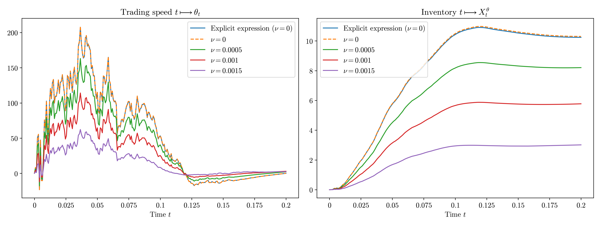
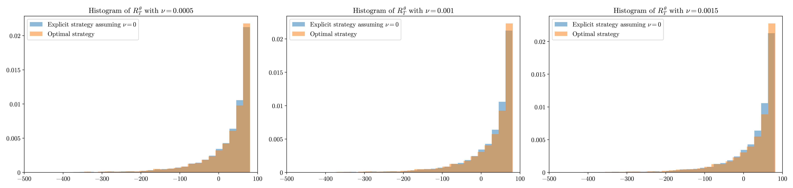
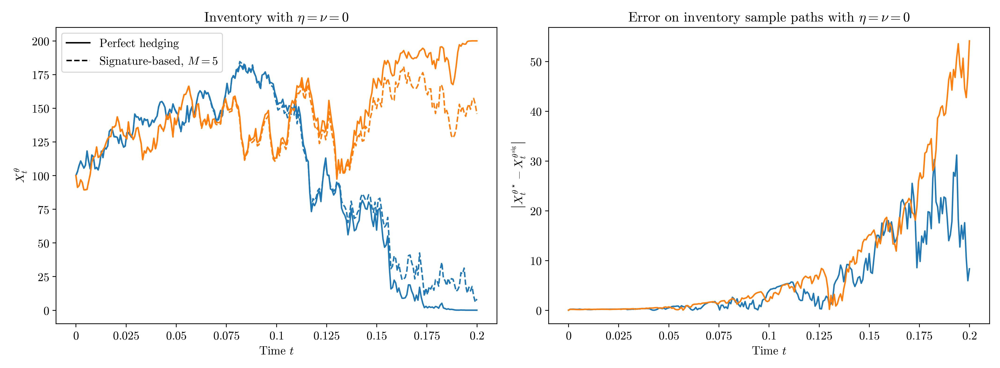
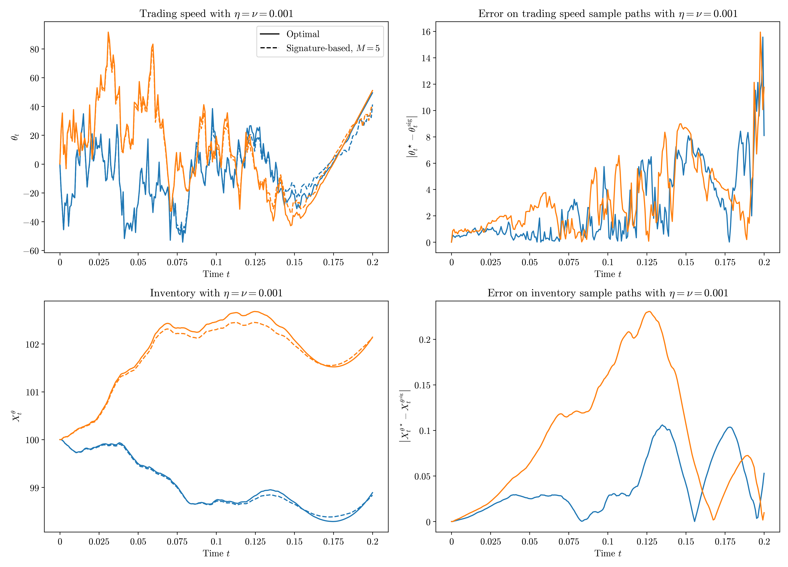

### Signature approach for pricing and hedging path-dependent options with frictions

This repository reproduces the results of  [Abi Jaber, Hainaud and Motte (2025)](https://www.arxiv.org/pdf/2511.23295).  

We implement:

### Examples of illustrations 

### Disclaimer 
Source code is available upon request. Please contact me directly. 